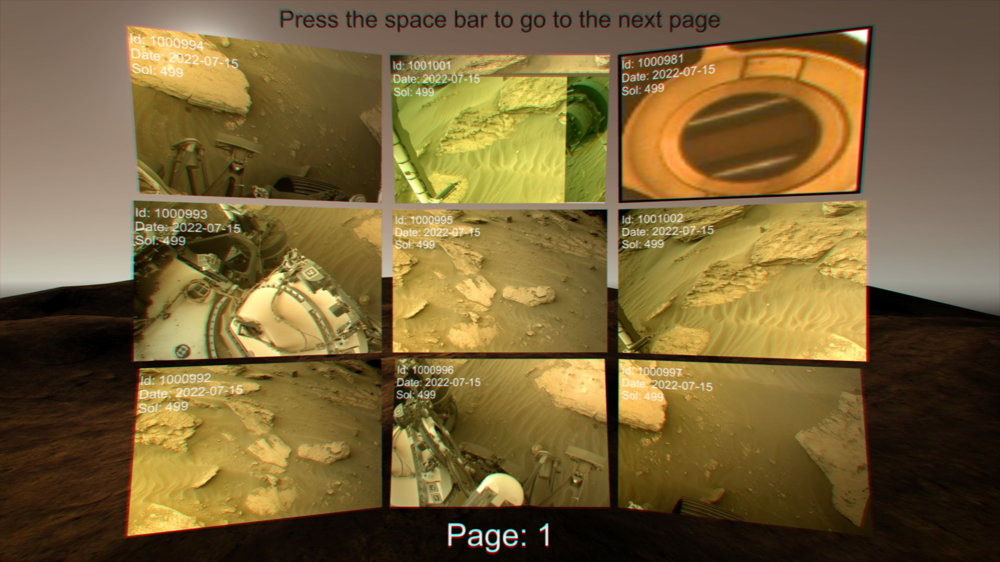
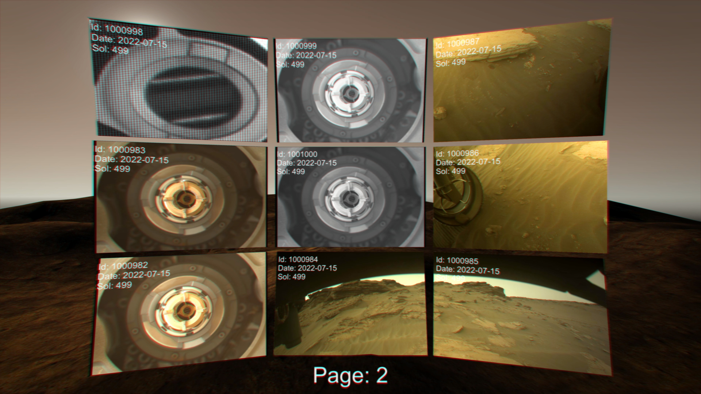
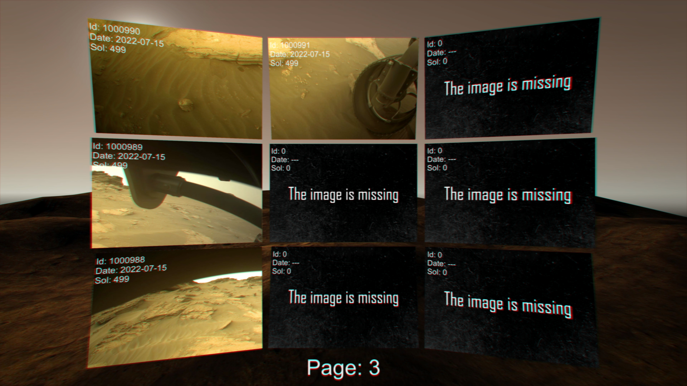

# NASAsMarsPhotos
Get fresh photos of the Martian surface from NASA rovers!

This asset allows you to get photos taken on Mars in recent days.

It receives and extracts links to images from a JSON file, then downloads and displays them on one of 9 screens. If you want to do something similar, you can download this asset for free and customize it for yourself.

Also in the new update, the ability to set the date when the photos were taken has been added.

Supported platforms: Android/IOS/PC

# Screenshots

